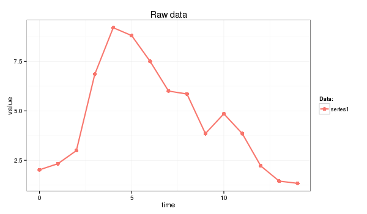
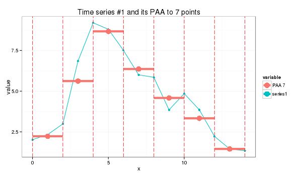
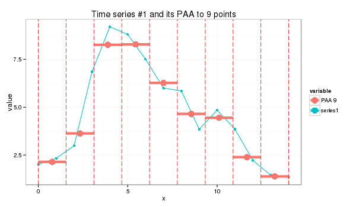

# Piecewise Aggregate Approximation of time series

PAA approximates a time-series *X* of length *n* into vector $\bar{X}=(\bar{x}\_{1},...,\bar{x}\_{M})$ of any arbitrary length $ M \leq n $ where each of $ \bar{x\_{i}} $ is calculated as follows:

$$ \bar{x}_{i} = \frac{M}{n} \sum_{j=n/M(i-1)+1}^{(n/M)i} x_{j} $$

Which simply means that in order to reduce the dimensionality from *n* to *M*, we first divide the original time-series into *M* equally sized frames and secondly compute the mean values for each frame. The sequence assembled from the mean values is the PAA approximation (i.e., transform) of the original time-series. As it was shown by Keogh et al, the complexity of the PAA transform can be reduced from *O(NM)* to *O(Mm)* where *m* is the number of frames. By using the following distance measure

$$ D_{PAA}(\bar{X},\bar{Y}) \equiv \sqrt{\frac{n}{M}} \sqrt{ \sum_{i=1}^{M} \left( \bar{x}_{i}-\bar{y}_{i} \right) } $$

 Yi & Faloutsos, and Keogh et al, have shown that PAA satisfies to the lower bounding condition and guarantees no false dismissals, i.e.:
 
$$ D_{PAA}(\bar{X},\bar{Y}) \leq D(X,Y) $$

# Example

In this primer I use the next time series:

<pre>
series1 <- c(2.02, 2.33, 2.99, 6.85, 9.20, 8.80, 7.50, 6.00, 5.85, 3.85, 4.85, 3.85, 2.22, 1.45, 1.34)
</pre>

and the following R code:

<pre>
paa <- function(ts, paa_size){
  len = length(ts)
  if (len == paa_size) {
    ts
  }
  else {
    if (len %% paa_size == 0) {
      colMeans(matrix(ts, nrow=len %/% paa_size, byrow=F))
    }
    else {
      res = rep.int(0, paa_size)
      for (i in c(0:(len * paa_size - 1))) {
        idx = i %/% len + 1# the spot
        pos = i %/% paa_size + 1 # the col spot
        res[idx] = res[idx] + ts[pos]
      }
      for (i in c(1:paa_size)) {
        res[i] = res[i] / len
      }
      res
    }
  }
}
</pre>

whose application produces a seven-point piecewise aggregate approximation:

<pre>
s1_paa = paa(series1,7)
(2.23, 5.62, 8.67, 6.36, 4.58, 3.33, 1.45)
</pre>

or a 9-point approximation which is a bit trickier:

<pre>
s1_paa = paa(series1,9)
(2.14, 3.63, 8.26, 8.28, 6.27, 4.65, 4.45, 2.39, 1.38)
</pre>

