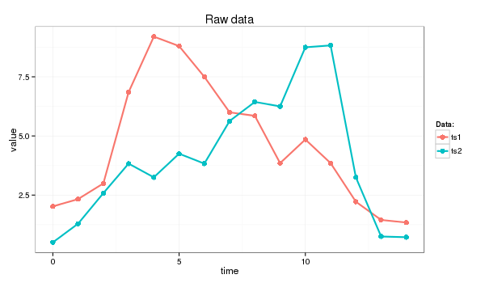
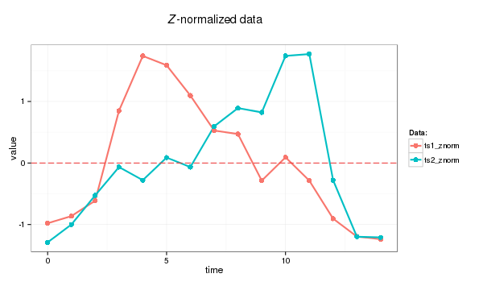
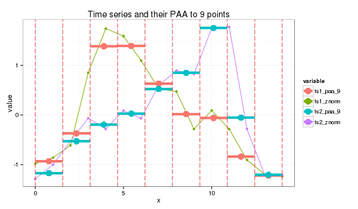

# Symbolic Aggregate approXimation.

### Introduction
In short, Symbolic Aggregate approXimation (SAX) algorithm application to the input time series transforms its into a strings.

The algoithm was proposed by [Lin et al.](http://www.cs.ucr.edu/~eamonn/SAX.htm)) and extends the PAA-based approach inheriting the original algorithm simplicity and low computational complexity while providing satisfactory sensitivity and selectivity in range query processing. Moreover, the use of a symbolic representation opened a door to the existing wealth of data-structures and string-manipulation algorithms in computer science such as hashing, regular expression, pattern matching, suffix trees, and [grammatical inference](http://grammarviz2.github.io/grammarviz2_site/).

### The algorithm
SAX transforms a time-series *X* of length *n* into the string of arbitrary length $\omega$, where $\omega << n$ typically, using an alphabet *A* of size *a > 2*. The algorithm consist of two steps: (i) it transforms the original time-series into the [PAA representation](PAA.html) and (ii) it converts the PAA data into a string.

The use of PAA brings advantages of a simple and efficient dimensionality reduction while providing the important lower bounding property. The actual conversion of PAA coefficients into letters by using a lookup table is also computationally efficient and the contractive property of symbolic distance was proven by Lin et al.

Discretization of the PAA representation of a time-series into SAX is implemented in a way which produces symbols corresponding to the time-series features with equal probability. The extensive and rigorous analysis of various time-series datasets available to the original algorithm's authors has shown that the values of [_z_-normalized](znorm.html) time-series  follow the Normal distribution. By using its properties it's easy to pick *a* equal-sized areas under the Normal curve using lookup tables for the cut lines coordinates, slicing the under-the-Gaussian-curve area.

The *x* coordinates of these lines called _breakpoints_ or _cuts_ in the SAX context. The list of breakpoints $ B = \beta\_{1}, \beta\_{2} ,..., \beta\_{a-1} $ such that $\beta\_{i-1}<\beta\_{i}$ and $\beta\_{0}=-\infty$, $\beta\_{a}=\infty$ divides the area under *N(0,1)* into *a* equal areas. By assigning a corresponding alphabet symbol $alpha\_{j}$ to each interval $[\beta\_{j-1},\beta\_{j})$, the conversion of the vector of PAA coefficients $\bar{C}$ into the string $\hat{C}$ implemented as follows:

$$ \hat{c} * {i} = alpha * {j}, \; \text{iif}, \; \bar{c}*{i} \in [ \beta_{j-1}, \beta_{j} ) $$

SAX introduces new metrics for measuring distance between strings by extending Euclidean and PAA distances.
The function returning the minimal distance between two string representations of original time series $\hat{Q}$ and $\hat{C}$ is defined as

$$MINDIST(\hat{Q},\hat{C})\equiv\sqrt{\frac{n}{w}}\sqrt{\sum_{i=1}^{w}(dist(\hat{q}*{i},\hat{c}*{i}))^{2}}$$

where the *dist* function is implemented by using the lookup table for the particular set of the breakpoints (alphabet size) as shown
in the Table below, and where the singular value for each cell *(r,c)* is computed as

$$ cell\_{(r,c)} = \begin{cases} 0, \text{if} \left|r-c \right| \leq 1 \\ \beta_{\max(r,c)-1} - \beta_{\min(r,c)-1}, \text{otherwise}\end{cases}$$

**The lookup table for 4-letters alphabet**

| &nbsp;&nbsp;&nbsp;&nbsp;&nbsp;        | &nbsp;&nbsp;&nbsp;&nbsp;&nbsp;a&nbsp;&nbsp;&nbsp;&nbsp;&nbsp;          | &nbsp;&nbsp;&nbsp;&nbsp;&nbsp;b&nbsp;&nbsp;&nbsp;&nbsp;&nbsp;          | &nbsp;&nbsp;&nbsp;&nbsp;&nbsp;c&nbsp;&nbsp;&nbsp;&nbsp;&nbsp;          | &nbsp;&nbsp;&nbsp;&nbsp;&nbsp;d&nbsp;&nbsp;&nbsp;&nbsp;&nbsp;          |
|:--------|:----------:|:----------:|:----------:|:----------:|
| a       | 0          | 0          | 0.67       | 1.34       |
| b       | 0          | 0          | 0          | 0.67       |
| c       | 0.67       | 0          | 0          | 0          |
| d       | 1.34       | 0.67       | 0          | 0          |

As shown by Li et al, this SAX distance metrics lower-bounds the PAA distance, i.e.

$$ \sum_{i=1}^{n}(q_{i}-c_{i})^{2} \geq n(\bar{Q}-\bar{C})^{2} \geq n(dist(\hat{Q},\hat{C}))^2 $$

The SAX lower bound was examined by Ding et al in great detail and found to be superior in precision to the spectral decomposition methods on bursty (non-periodic) data sets.

### SAX primer

### _1.0 Timeseries data_

I will use following time series for this example (the Euclidean distance between ts1 and ts2 is 11.4):

<pre>
> ts1=c(2.02, 2.33, 2.99, 6.85, 9.20, 8.80, 7.50, 6.00, 5.85, 3.85, 4.85, 3.85, 2.22, 1.45, 1.34)
> ts2=c(0.50, 1.29, 2.58, 3.83, 3.25, 4.25, 3.83, 5.63, 6.44, 6.25, 8.75, 8.83, 3.25, 0.75, 0.72)
> dist(rbind(ts1,ts2), method = "euclidean")
         ts1
ts2 11.42126
</pre>

**which I'll transform into strings of length 9 whose letters come from an alphabet of size 4**

### _2.0 Z-normalization_

Before transforming timeseries with SAX we _Z_-normalize data first:

<pre>
znorm <- function(ts){
  ts.mean <- mean(ts)
  ts.dev <- sd(ts)
  (ts - ts.mean)/ts.dev
}

ts1_znorm=znorm(ts1)
ts2_znorm=znorm(ts2)
</pre>

[PAA](PAA.html) follows the standard procedure:

### _3.0 PAA transform_

PAA
<pre>
paa <- function(ts, paa_size){
  len = length(ts)
  if (len == paa_size) {
    ts
  }
  else {
    if (len %% paa_size == 0) {
      colMeans(matrix(ts, nrow=len %/% paa_size, byrow=F))
    }
    else {
      res = rep.int(0, paa_size)
      for (i in c(0:(len * paa_size - 1))) {
        idx = i %/% len + 1# the spot
        pos = i %/% paa_size + 1 # the col spot
        res[idx] = res[idx] + ts[pos]
      }
      for (i in c(1:paa_size)) {
        res[i] = res[i] / len
      }
      res
    }
  }
}
paa_size=9
s1_paa = paa(ts1_znorm,paa_size)
s2_paa = paa(ts2_znorm,paa_size)
</pre>

### _4.0 PAA values to letters_

I use the 4 symbols alphabet {a,b,c,d} as in the table above. The cut lines for this alphabet shown as the thin blue lines on the plot below.

SAX transform of ts1 into string through 9-points PAA: "abddccbaa"

SAX transform of ts2 into string through 9-points PAA: "abbccddba"

SAX distance: 0 + 0 + 0.67 + 0 + 0 + 0 + 0.67 + 0 + 0 = 1.34 

_At the plot, orange color depicts symbols distance between which is counted - they are not "adjacent" to each other in the table._