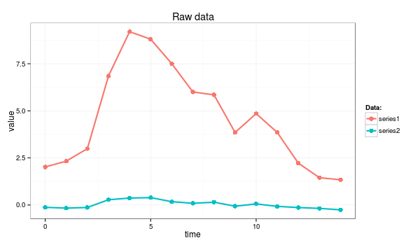
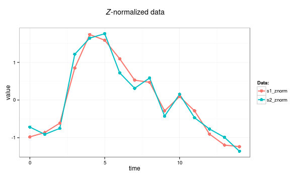

# _Z_-normalization of time series.

**_Z_-normalization**, also known as **"Normalization to Zero Mean and Unit of Energy"**, was first mentioned by <a href="https://github.com/jMotif/sax-vsm_site/raw/gh-pages/morea/assets/cp95.pdf">Goldin & Kanellakis</a>. The procedure ensures, that all elements of the input vector are transformed into the output vector whose mean is approximately 0 while the standard deviation is in a range close to 1. The formula behind the transform is shown below:

$$x^{'}_{i}=\frac{x_{i}-\mu}{\sigma}, \text{ where } i \in \mathbb{N}$$

As shown, the time series mean is subtracted from original values at first, and the difference is divided by the standard deviation value second. According to most of the recent work concerned with time series mining, _z_-normalization is an essential preprocessing step which allows an algorithm to focus on the structural similarities/dissimilarities rather than on the amplitude.

Note however, that in some cases, this preprocessing is not recommended as it introduces biases. For example, if the signal variance is significantly small, _z_-normalization will simply overamplify the noise to the unit of amplitude. Yet another extreme case is when a time series contains the same values and the standard deviation is not defined.

## Example:
An example below demonstrates the highly desirable property of _z_-normalization: whereas the raw time series look significantly different, their _z_-normalized versions are highly similar.

### Example: The raw time series

<pre>
series1 <- c(2.02, 2.33, 2.99, 6.85, 9.20, 8.80, 7.50, 6.00, 5.85, 3.85, 4.85, 3.85, 2.22, 1.45, 1.34) 
series2 <- c(-0.12, -0.16, -0.13,  0.28,  0.37,  0.39,  0.18,  0.09,  0.15, -0.06,  0.06, -0.07, -0.13, -0.18, -0.26) 
</pre>

_z_-normalization can be coded as a simple R function:

<pre>
znorm <- function(ts){
  ts.mean <- mean(ts)
  ts.dev <- sd(ts)
  (ts - ts.mean)/ts.dev
}

s1_znorm=znorm(series1)
s2_znorm=znorm(series2)
</pre>

### Example: time series after _Z_-normalization

